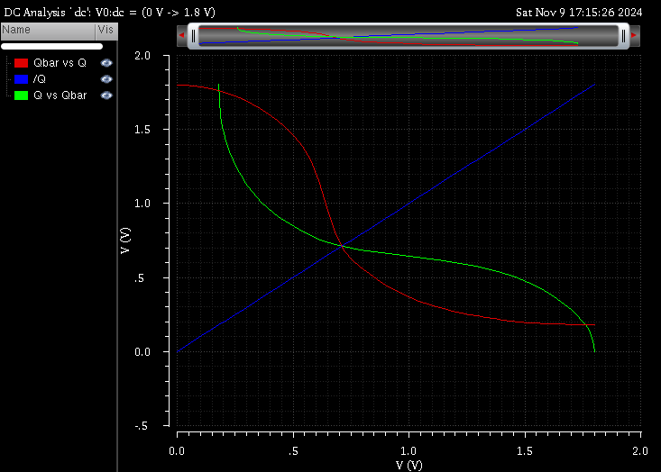

<div align="center">

# CMOS Design Project: 7T MCPL SRAM Cell
 <br>
## Indian Institute of Information Technology, Nagpur  
**ECL 312: CMOS Design**  
**A Project Report on: 7T MCPL SRAM Cell**

**Submitted By:**  
[Jjateen Gundesha (BT22ECI002)](https://github.com/Jjateen)  

**Under the Guidance of:**  
Prof. Paritosh Peshwe  

**Department of Electronics and Communication**  

</div>

---

## Project Overview

This repository contains the design and simulation of a **7T MCPL (Multi-Clock Power Logic) SRAM cell**, using **adiabatic logic** to optimize power consumption. The project compares the performance of a conventional **6T SRAM** and the novel **7T MCPL SRAM** design under **180nm CMOS technology** using simulation tools such as **WinSpice** and **Microwind**.

Adiabatic logic, known for its ability to reuse energy, is employed in the **7T MCPL SRAM cell** to achieve significant power savings compared to traditional CMOS designs.

## Objectives

1. **Design and simulate** a 7T SRAM cell using **MCPL adiabatic logic**.
2. Compare the performance of the **6T SRAM** and **7T MCPL SRAM** designs.
3. Demonstrate power and energy savings achieved by the MCPL design under **180nm technology**.
4. Simulate **read** and **write operations** of both 6T and 7T SRAM cells.

## Design Description

### 6T SRAM Cell
The 6T SRAM cell is a well-established design, featuring two cross-coupled inverters that store data. It consists of:
- **6 transistors** (4 for inverters, 2 for access transistors).
- Stable operation but higher power dissipation compared to the 7T MCPL design.

### 7T MCPL SRAM Cell
The 7T MCPL design incorporates **adiabatic logic** principles, specifically using **Multi-Clock Power Logic (MCPL)** to reduce power dissipation:
- **7 transistors**, with the extra transistor providing better stability and noise immunity.
- **AC power supply** through MCPL to reuse energy, significantly lowering power consumption.
- Control signals **S1** and **S2** manage the MCPL node, transitioning between high, low, and floating states based on the operating mode.

## Simulation Files

Below are snippets of the circuit files used for simulation in **WinSpice**:

### 6T SRAM Write Mode

```spice
.model nmod nmos level=54 version=4.7
.model pmod pmos level=54 version=4.7

.subckt inverter 1 2 3
M1 3 1 0 0 pmod w=100u l=10u
M2 3 1 2 2 nmod w=100u l=10u
.ends

Vdd 2 0 dc 5
Vwl 6 0 dc 5

Vbit 7 0 pulse(0 5 0 0 0 100m 200m)
Vbitbar 8 0 pulse(5 0 0 0 0 100m 200m)

Xq 1 2 3 inverter
Xqbar 3 2 1 inverter

M5 7 6 3 3 pmod w=100u l=10u
M6 8 6 1 1 pmod w=100u l=10u

.tran 0.1m 400m
.control
run
plot v(7) v(8) v(3) v(1)
.endc
.end
```

### 7T MCPL SRAM Write Mode

```spice
.model nmod nmos level=54 version=4.7
.model pmod pmos level=54 version=4.7

.subckt inverter G Sp D
M1 D G 0 0 nmod w=100u l=10u
M2 D G Sp Sp pmod w=200u l=10u
.ends

Vdd 2 0 dc 5
Vwl 6 0 dc 5
Vwlb 9 0 dc 0
Vbit 7 0 dc 5
Vbitbar 8 0 dc 0
Vs1 13 0 pulse(0 5 0 0 0 200m 400m)
Vs2 11 0 pulse(0 5 0 0 0 100m 200m)

Xq 1 10 3 inverter
Xqbar 3 10 1 inverter

M5 7 6 3 3 nmod w=100u l=10u
M6 8 6 1 1 nmod w=100u l=10u
M7 3 9 3 0 nmod w=100u l=10u
M9 10 11 2 2 pmod w=200u l=10u
M10 10 13 0 0 nmod w=100u l=10u

.tran 0.1m 400m
.control
run
plot v(7) v(8) v(3) v(1) v(13) v(11)
.endc
.end
```

## Layout and Waveforms

### 6T SRAM Layout
<div align="center">
    
</div>

### 7T MCPL SRAM Layout
<div align="center">
    
</div>

### 6T SRAM Waveforms


### 7T MCPL SRAM Waveforms


### 6T SRAM SNM
<div align="center">
    
</div>

### 7T MCPL SRAM SNM
<div align="center">
    
</div>

## Static Noise Margin (SNM) Analysis

From **Figures 8 and 9** in the referenced paper, we observe the stability of the **6T** and **7T MCPL SRAM** cells. The SNM, or Static Noise Margin, indicates the cell's resilience to noise and disturbances during read/write operations.

- **SNM is calculated** by connecting **DC voltages** on both sides of the inverter. The **butterfly diagram** is drawn by plotting the inverter voltage transfer characteristics. A **maximum square** is inscribed within the butterfly curve by moving the vertical and horizontal axes.
  
- In the SNM analysis:
    - The **6T SRAM** shows a smaller area in the butterfly curve, indicating lower stability.
    - The **7T MCPL SRAM** demonstrates a **0.3 times greater SNM** than the 6T SRAM, reflecting improved stability and noise tolerance.

This increase in SNM for the 7T MCPL SRAM is due to the added transistor and better isolation of the internal nodes during read/write operations, as explained in the **Why is the 7T MCPL SRAM more stable than the 6T SRAM?** section.

## Performance Comparison

### Power and Energy Consumption

Simulation results show a significant reduction in power and energy consumption using MCPL logic. Below are the power and energy figures for both designs under **180nm and 32nm technology**:

| SRAM Cell                        | Power (W)     | Energy (J)        | Power (W) (32nm) | Energy (J) (32nm) |
|-----------------------------------|---------------|-------------------|------------------|-------------------|
| **6T SRAM**                      | 85.6e-6       | 15.4e-9           | 4.6e-6           | 0.64e-12          |
| **7T SRAM**                      | 90.2e-6       | 6.32e-9           | 24.9e-6          | 13.4e-12          |
| **7T SRAM with MCPL**             | 30.1e-7       | 117.9e-15         | 5.4e-7           | 40.5e-15          |

### Stability (SNM)
The **Static Noise Margin (SNM)** analysis confirms that the **7T MCPL SRAM** design is **0.3 times more stable** than the 6T SRAM design. The improved stability comes at the cost of slightly higher power consumption, but this is offset by the energy reuse achieved through MCPL logic.

### **Why is the 7T MCPL SRAM more stable than the 6T SRAM?**


1. **Additional Transistor (7T Design):**
   - The **7T MCPL SRAM** includes an **additional transistor** compared to the **6T SRAM**. This extra transistor enhances the control over the internal nodes of the SRAM cell during read and write operations.
   - The 6T SRAM has a greater tendency for **bitline disturbances** during read operations, which can lead to instability. By adding an extra transistor, the 7T SRAM isolates the bitlines better from the stored data, improving stability.

2. **Improved Isolation:**
   - In the **6T SRAM**, both the **bitline** and the **cross-coupled inverters** are directly connected during read operations, which can cause the voltage at the storage nodes to fluctuate. This fluctuation reduces the stability of the cell.
   - The **7T design**, particularly with **MCPL logic**, isolates the stored data more effectively by controlling the connection between the bitlines and the storage nodes, leading to higher SNM.

3. **MCPL Adiabatic Logic:**
   - **Multi-Clock Power Logic (MCPL)** uses an **AC power supply** to control the power and ground connections in a dynamic way, which ensures smoother transitions of voltages during operations. This not only reduces power dissipation but also minimizes sudden voltage swings that can destabilize the cell.
   - The controlled **power recycling** in MCPL logic reduces the chances of abrupt voltage changes, which might otherwise cause read or write failures. This results in better retention of the stored data, thus improving the **noise margin**.

### **How does this impact power consumption?**

While the **7T MCPL SRAM** improves stability, it also introduces slightly higher power consumption due to:
- **More active transistors**: The 7T design has an additional transistor that adds to the switching activity, leading to increased power consumption.
- **Adiabatic logic overhead**: MCPL logic involves additional control signals (S1 and S2) and transistors that manage power recycling, which can slightly increase the dynamic power consumption.

However, **MCPL logic** helps **reuse energy**, significantly reducing overall power dissipation compared to a traditional 7T design. Thus, the small increase in dynamic power is compensated by the **energy reuse** and the improved **noise resilience** of the cell.

## Conclusion

This project demonstrates the successful design and simulation of a **7T MCPL SRAM cell** using adiabatic logic. The MCPL-based design achieves over **90% reduction in power dissipation** compared to conventional 7T SRAM designs, while maintaining stability and performance.

### Future Work
Further optimization of the 7T MCPL SRAM can focus on:
1. Reducing the area and parasitic capacitances.
2. Exploring the use of **FINFET** technology for lower power dissipation in sub-32nm nodes.

## References

This project is based on the work described in the following paper:

> **Penugonda, R.S., & Ravi, V.** (2020). *Design of Low Power SRAM Cell Using Adiabatic Logic*. Journal of Physics: Conference Series, 1716(1), 012039. doi:10.1088/1742-6596/1716/1/012039【6†source】

---
