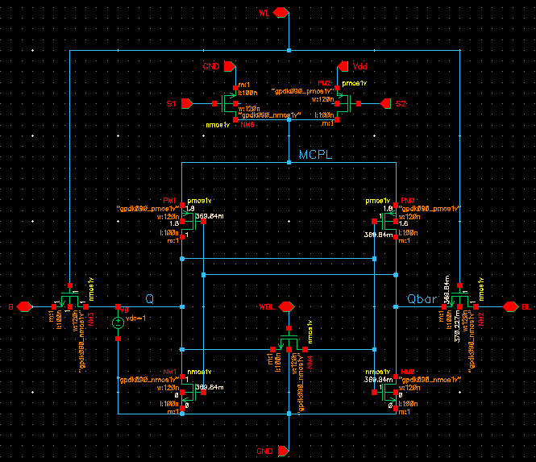
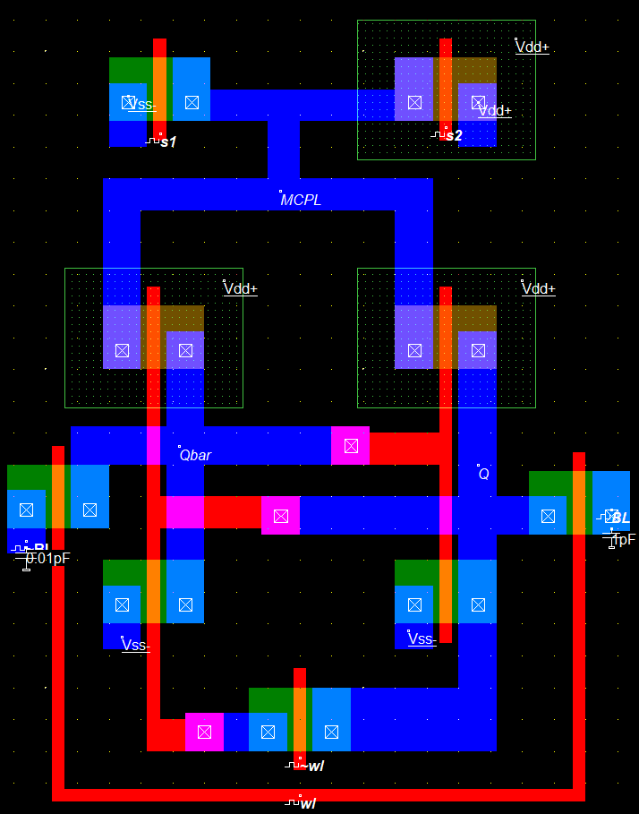
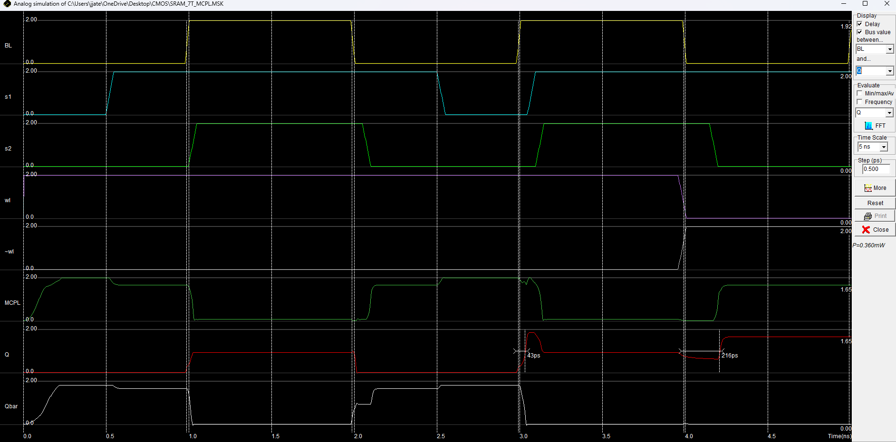
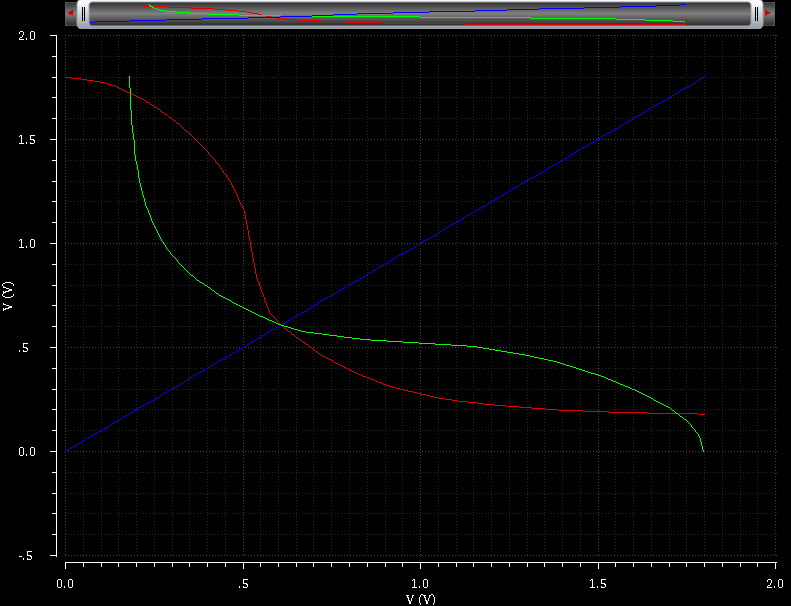

<div align="center">

# CMOS Design Project: 7T MCPL SRAM Cell
 <br>
## Indian Institute of Information Technology, Nagpur  
**ECL 312: CMOS Design**  
**A Project Report on: 7T MCPL SRAM Cell**

**Submitted By:**  
[Jjateen Gundesha (BT22ECI002)](https://github.com/Jjateen)  

**Under the Guidance of:**  
Prof. Paritosh Peshwe  

**Department of Electronics and Communication**  

</div>

## Project Overview

This repository contains the design and simulation of a **7T MCPL (Multi-Clock Power Logic) SRAM cell**, utilizing **adiabatic logic** to optimize power consumption. The project compares the performance of a conventional **6T SRAM** and the novel **7T MCPL SRAM** design under **180nm CMOS technology**, using tools like **WinSpice**, **Microwind**, and **Cadence Virtuoso** for layout and Static Noise Margin (SNM) analysis.

Adiabatic logic, known for its energy-recycling capabilities, is employed in the **7T MCPL SRAM cell** to achieve significant power savings compared to traditional CMOS designs.

## Objectives

1. **Design and simulate** a 7T SRAM cell using **MCPL adiabatic logic**.
2. Compare the performance of the **6T SRAM** and **7T MCPL SRAM** designs.
3. Demonstrate power and energy savings achieved by the MCPL design under **180nm technology**.
4. Simulate **read** and **write operations** of both 6T and 7T SRAM cells.
5. Analyze the **Static Noise Margin (SNM)** of both designs, using **Cadence Virtuoso** for SNM plotting.

## Design Description

### 6T SRAM Cell
The 6T SRAM cell is a well-established design, featuring two cross-coupled inverters that store data. It consists of:
- **6 transistors** (4 for inverters, 2 for access transistors).
- Stable operation but higher power dissipation compared to the 7T MCPL design.

#### 6T SRAM Circuit
<div align="center">
    
</div>

### 7T MCPL SRAM Cell
The 7T MCPL design incorporates **adiabatic logic** principles, specifically using **Multi-Clock Power Logic (MCPL)** to reduce power dissipation:
- **7 transistors**, with the extra transistor providing better stability and noise immunity.
- **AC power supply** through MCPL to reuse energy, significantly lowering power consumption.
- Control signals **S1** and **S2** manage the MCPL node, transitioning between high, low, and floating states based on the operating mode.

#### 7T MCPL SRAM Circuit
<div align="center">
    
</div>

## Simulation Files

Below are snippets of the circuit files used for simulation in **WinSpice**:

### 6T SRAM Write Mode

```spice
.model nmod nmos level=54 version=4.7
.model pmod pmos level=54 version=4.7

.subckt inverter 1 2 3
M1 3 1 0 0 pmod w=100u l=10u
M2 3 1 2 2 nmod w=100u l=10u
.ends

Vdd 2 0 dc 5
Vwl 6 0 dc 5

Vbit 7 0 pulse(0 5 0 0 0 100m 200m)
Vbitbar 8 0 pulse(5 0 0 0 0 100m 200m)

Xq 1 2 3 inverter
Xqbar 3 2 1 inverter

M5 7 6 3 3 pmod w=100u l=10u
M6 8 6 1 1 pmod w=100u l=10u

.tran 0.1m 400m
.control
run
plot v(7) v(8) v(3) v(1)
.endc
.end
```

### 7T MCPL SRAM Write Mode

```spice
.model nmod nmos level=54 version=4.7
.model pmod pmos level=54 version=4.7

.subckt inverter G Sp D
M1 D G 0 0 nmod w=100u l=10u
M2 D G Sp Sp pmod w=200u l=10u
.ends

Vdd 2 0 dc 5
Vwl 6 0 dc 5
Vwlb 9 0 dc 0
Vbit 7 0 dc 5
Vbitbar 8 0 dc 0
Vs1 13 0 pulse(0 5 0 0 0 200m 400m)
Vs2 11 0 pulse(0 5 0 0 0 100m 200m)

Xq 1 10 3 inverter
Xqbar 3 10 1 inverter

M5 7 6 3 3 nmod w=100u l=10u
M6 8 6 1 1 nmod w=100u l=10u
M7 3 9 3 0 nmod w=100u l=10u
M9 10 11 2 2 pmod w=200u l=10u
M10 10 13 0 0 nmod w=100u l=10u

.tran 0.1m 400m
.control
run
plot v(7) v(8) v(3) v(1) v(13) v(11)
.endc
.end
```

## Layout and Waveforms

### 6T SRAM Layout
<div align="center">
    
</div>

### 7T MCPL SRAM Layout
<div align="center">
    
</div>

### 6T SRAM Waveforms


### 7T MCPL SRAM Waveforms


### 6T SRAM SNM
<div align="center">
    
</div>

### 7T MCPL SRAM SNM
<div align="center">
    
</div>

## Static Noise Margin (SNM) Analysis

The **SNM** was calculated and plotted using **Cadence Virtuoso**. The SNM analysis indicates the stability of the **6T** and **7T MCPL SRAM** cells. This analysis was performed by inscribing a **maximum square** within the butterfly curve, plotting the inverter voltage transfer characteristics.

- **6T SRAM**: Shows a smaller area in the butterfly curve, indicating lower stability.
- **7T MCPL SRAM**: Demonstrates a **0.3 times greater SNM** than the 6T SRAM, reflecting improved stability and noise tolerance.

The increased SNM of the 7T MCPL SRAM is due to the added transistor and better isolation of the internal nodes, as described in the **Why is the 7T MCPL SRAM more stable than the 6T SRAM?** section.

## Performance Comparison

### Power and Energy Consumption

Simulation results show a significant reduction in power and energy consumption using MCPL logic. Below are the power and energy figures for both designs under **180nm and 32nm technology**:

| SRAM Cell                        | Power (W)     | Energy (J)        | Power (W) (32nm) | Energy (J) (32nm) |
|-----------------------------------|---------------|-------------------|------------------|-------------------|
| **6T SRAM**                      | 85.6e-6       | 15.4e-9           | 4.6e-6           | 0.64e-12          |
| **7T SRAM**                      | 90.2e-6       | 6.32e-9           | 24.9e-6          | 13.4e-12          |
| **7T SRAM with MCPL**             | 30.1e-7       | 117.9e-15         | 5.4e-7           | 40.5e-15          |

### Stability (SNM)

The **Static Noise Margin (SNM)** analysis shows that the **7T MCPL SRAM** design is **0.3 times more stable** than the 6T SRAM design, providing enhanced stability and noise resilience.

### Why is the 7T MCPL SRAM more stable than the 6T SRAM?

1. **Additional Transistor**: The 7T

 design incorporates an extra transistor for improved node isolation and stability.
2. **Energy-Recycling via MCPL**: The MCPL architecture reduces power dissipation, improving noise immunity.
3. **Lower Noise Disturbance**: By reducing noise disturbances on internal nodes, the 7T SRAM achieves a greater **SNM**, signifying better tolerance to environmental noise.

## Conclusion

The **7T MCPL SRAM cell** provides significant improvements in power efficiency, stability, and noise resilience compared to the traditional **6T SRAM** design. Using **adiabatic logic** and MCPL, this project demonstrates the feasibility of low-power, high-stability SRAM designs.

### Future Work

Future enhancements could explore:
1. **Scaling** the design to smaller technology nodes for further efficiency gains.
2. **Integrating additional noise management techniques** for environments with high electromagnetic interference.

## References

1. [Cadence Tutorial](https://www.cadence.com/)
2. [Microwind User Guide](https://www.microwind.org/)
3. [WinSpice Documentation](https://www.winspice.com/)

This project is based on the work described in the following paper:

> **Penugonda, R.S., & Ravi, V.** (2020). *Design of Low Power SRAM Cell Using Adiabatic Logic*. Journal of Physics: Conference Series, 1716(1), 012039. doi:10.1088/1742-6596/1716/1/012039【6†source】
